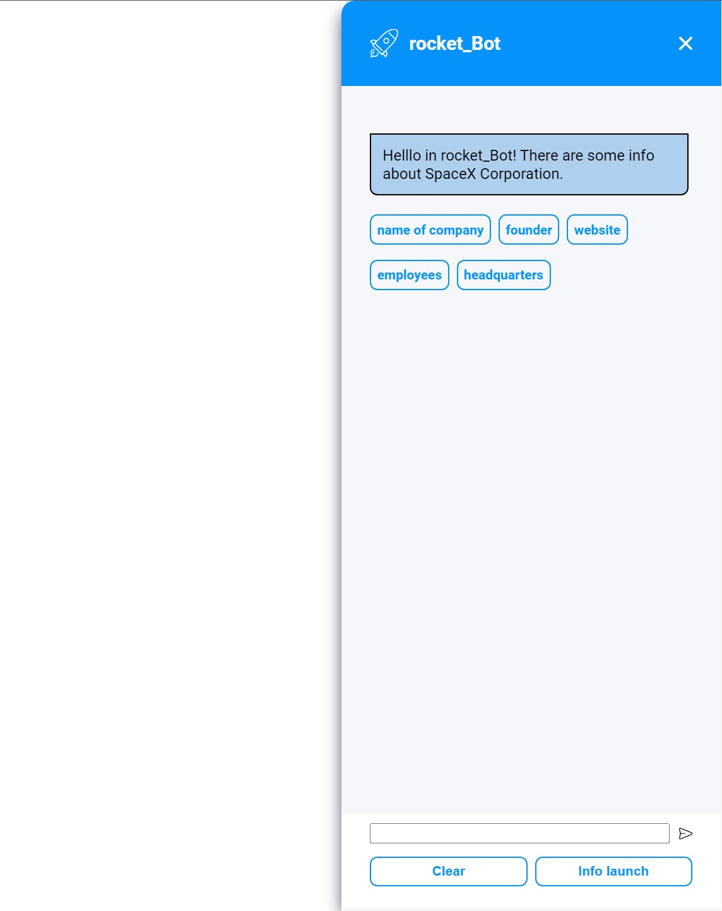

# 🚀 rocket_ChatBot
Check the basic info from: [SpaceX-API](https://github.com/r-spacex/SpaceX-API), and have fun! 🍰



## 📃 About The Project

rocket_ChatBot is a place to look for SpaceX rocket launches.

You can:
- Chcek the info about SpaceX Corporation.
- Quickly check out next and previous launches.


Problem solving:
While working on the project, the main problem was the application of the **SoC** principles.
I kept the Separation of Concerns by separation functionalities for individual classes.

## 🧐 Usage
* Click -> **rocket_Button** and...

* Click these clouds to get info about SpaceX Corporation.

* Type **command** to get:

next launch -> **@next**

latest launch -> **@latest**

* If you forget these command, don't worry, click **Info launch** and here you go!

* All meseges are saved in LocalStorage, to clear conversation click **Clear** button.

## 🔎 LIVE

* Visit -> [rocket_ChatBot](https://karol-czyzewski.github.io/rocket_ChatBot/)

## ⬇️ Installation
1. Clone the repo
```bash
git clone https://github.com/Karol-Czyzewski/rocket_ChatBot.git
```
2. Install NPM packages
```bash
npm install
```
3. Run the dev server
```bash
npm dev
```

## 💻 Used Technology
* HTML
* SCSS
* TS
* PARCEL
* LocalStorage
* REST API
